# Mercados Educativos en México
**ITAM - Centro de Investigación en Economía** 

## Shiny App: Visualización de áreas de desplazamiento y comunidades

Esta herramienta de visualización se generó utilizando la librería `shiny` del lenguage `R`, y tiene como objetivo presentar de manera práctica e informativa los resultados del ejercicio de generación de mercados educativos en México a nivel primaria y secundaria por medio de algorítmos de redes.

La visualización general de la aplicación es la siguiente: 

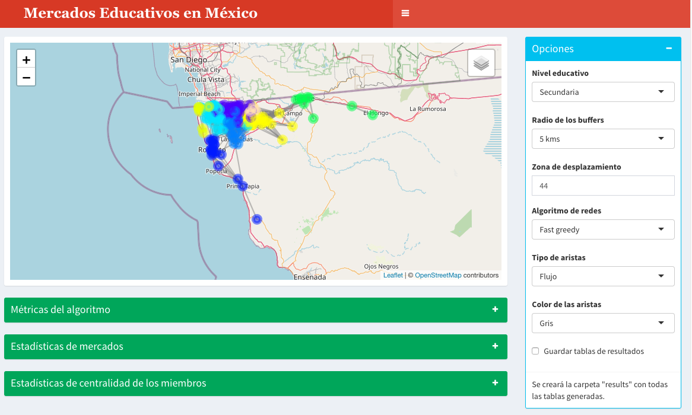

En las siguientes secciones se documenta su uso. 

### Mapa exploratorio:

El mapa exploratorio fue diseñado utilizando la librería `leaflet` y poder medio de las funciones de la misma puede ser modificado.  

El mapa es dinámico y el menú de opciones de visualización se presenta en la siguiente subsección. 

**Panel: Mapa**

Se incorporaron 7 capas al mapa, las cuales se pueden activar o desactivar por medio de un menú desplegable al cual se puede acceder en la esquina superior derecha de la sección donde se visualiza el mapa.

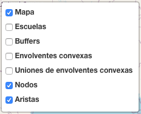

- Escuelas

Define si se desean adicionar todas las escuelas consideradas en el ejercicio. En la imagen de abajo, el círculo verde con un número 4 indica que en ese punto hay 4 escuelas. Si se hace zoom sobre esa área será posible visualizarlas. 

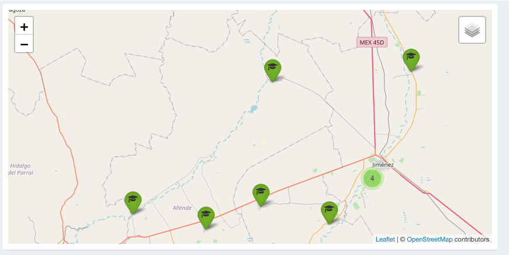

- Buffers

Permite visualizar los buffers de tamaño selecionado durante todo el ejercicio. En el siguiente ejemplo se visualizan algunos para el caso donde el radio de los mismos es de 5 kms. 

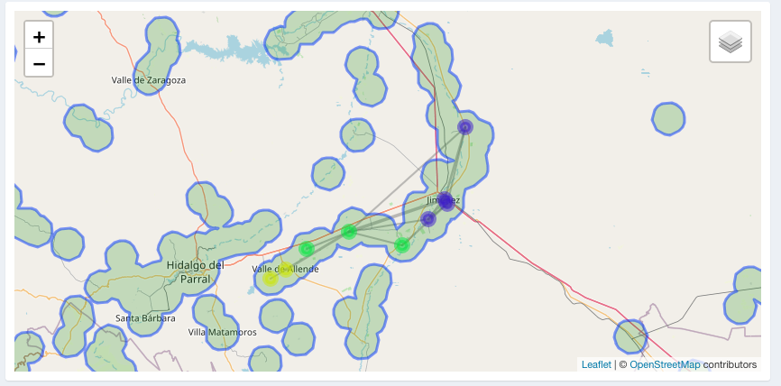

- Envolventes convexas

Incluye las envolventes convexas asociadas a los buffers analizados. 

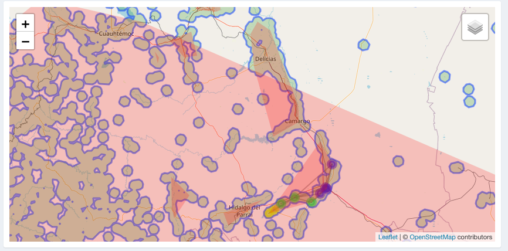

Incluye la unión de envolventes convexas asociadas a los buffers analizados. 

- Unión de envolventes convexas

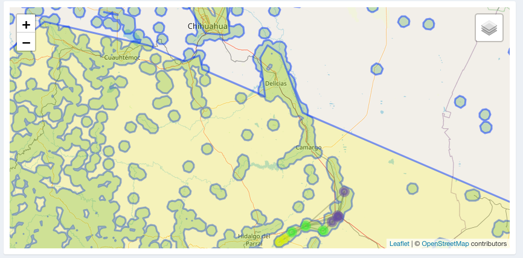

- Nodos y aristas

Incluyen las aristas y los nodos de la red del área de desplazamiento seleccionada utilizadas para el ejercicio de detección de comunidades. 

En la siguiente imagen se muestran estos elementos para el área de desplazamiento 505.

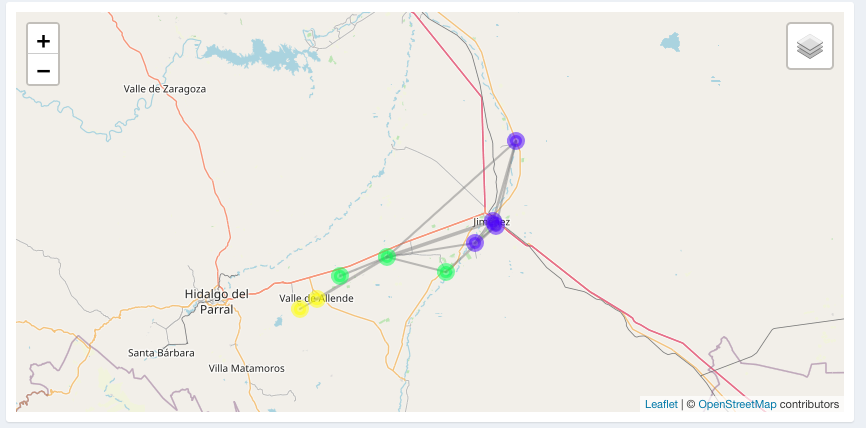

Cabe denotar que estos elementos tienen información interactiva que da información sobre la red. Por ejemplo, si se pone el puntero encima de los nodos, se presenta el CCT asociado a la escuela y el mercado educativo al que pertenece:

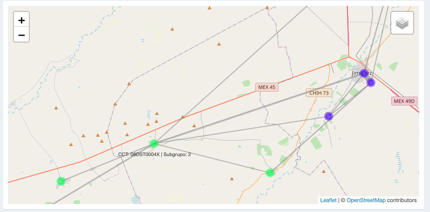

De igual forma, si se sitúa el puntero encima de las aristas de la red, se muestra el flujo de estudiantes (bidireccional) que hubo entre una y otra escuela:

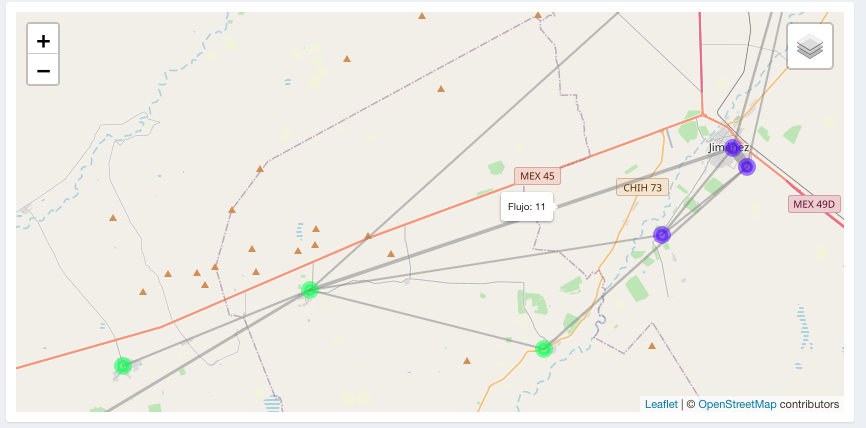

**Panel: Opciones**

El menú de opciones de visualización se presenta en el panel azul de la parte derecha de la aplicación:

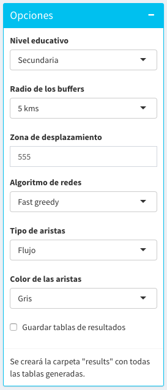

Las opciones disponibles son:

- _Nivel educativo_: Se selecciona si se desea evaluar el flujo de estudiantes de primaria o secundaria. 

- _Radio de los buffers:_: Se indica el radio de los buffers calculados, las opciones disponibles son: 5 kms, 8 kms, 12 kms, y 15 kms. 

- _Zona de desplazamiento_: Indica el ID de la zona de desplazamiento sobre la cual se quiere analizar la existencia de comunidades. 

- _Algoritmo de redes_ : Indica el algoritmo utilizado para detección de comunidades. Las opciones incluyen: fast greedy, Walktrap, LeadingEigen, LabelProp, y Multi-level. La implementación de estos algoritmos se realiza por medio de la librería `igraph`.

- _Tipo de aristas_ : Indica el tipo de relaciones que se quieren evaluar en la visualización de la red (actualmente se centra en el flujo bidireccional de estudiantes entre escuela) 

- _Color de las aristas_ : permite cambiar el color de las aristas de forma que permita una visualización más apropiada. 

**Panel: Composición de áreas de desplazamiento**

Muestra el número de escuelas que tiene determinada área de desplazamiento. 

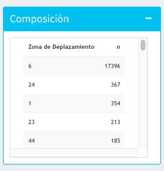

En la parte de abajo de la tabla se muestra información adicional sobre el número (porcentaje) de escuelas que tienen más de uno, dos o tres miembros. 

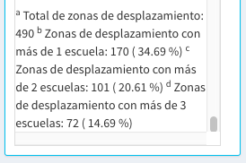

**Panel: Métricas del algoritmo**

Muestra las métricas de evaluación del algoritmo utilizado para la detección de comunidades: 

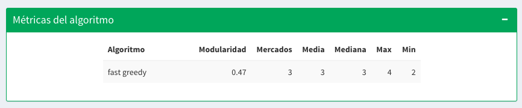

**Panel: Estadísticas de mercados**

Muestra las estadísticas generales de las comunidades generadas al interior del área de desplazamiento seleccionada. 

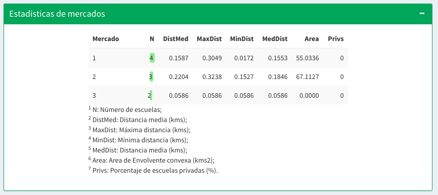

**Panel: Medidas de centralidad**

Muestra las medidas de centralidad de los nodos analizados en la red generada en el área de desplazamiento seleccionada. 

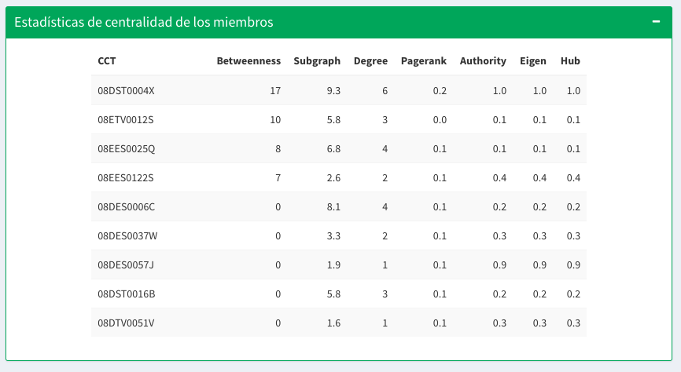

**Panel: Miembros de comunidades**

Muestra en una tabla el CCT de cada escuela y el mercado educativo al que pertenece de acuerdo al algoritmo seleccionado. 

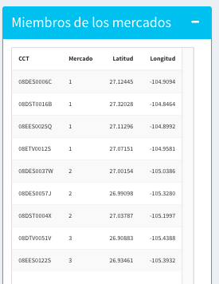
