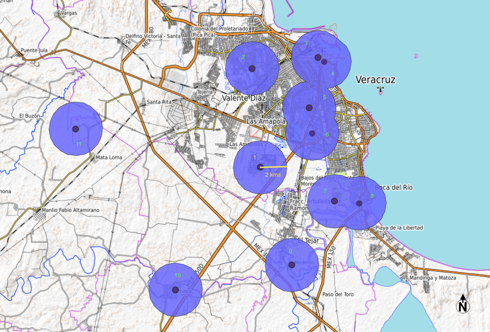
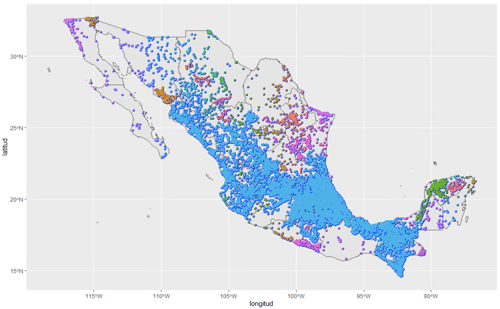

# Reporte de Mercados Educativos
**CIE**

## Datos

### Fuentes:

- INIFED
- Geopaquetes
- SEP


### Filtros:

- Se omitieron aquellas instituciones cuyas coordenadas se encontraran fuera de los puntos extremos definidos para México[^1], es decir, que tuvieran latitud por fuera del rango, $\left[15,33\right]$, y longitudes por fuera del rango, $\left[-120, -85\right]$.

[^1]: Correspondientes a: Isla mujeres (Quintana Roo) [Punto más oriental]; Roca Elefante en Isla de Guadalupe [Punto más occidental]; Desembocadura del río Suchiate (Chiapas) [punto más meridional]; y Monumento 206 (Baja California) [punto más septentrional].


### Grafos

La definición de mercados educativos utilizó modelos de grafos y construyó en dos pasos: i) se computan _commuting areas_[^2] utilizando los datos de municipio de la residencia de los estudiantes y de las escuelas; ii), dentro de esas _commuting areas_, se usaron métodos de agrupación de aristas en cada grafo construido con las escuelas dentro de la _commuting area_. 

[^2]: Territorios en los cuales gente con ciertas características socioeconómicas y geográficas en común se desplaza diariamente.


En detalle, para calcular los pesos en las artistas, se construyeron matrices de adyacencia que dicen cuántos alumnos tienen en común cada par de colegios, para un periodo dado de tiempo y restringiendo la muestra a alumnos que se cambian entre escuelas _switchers_. 

Utilizando la matriz de adyacencia, se obtuvieron redes con las cuales se extrajeron los mercados utilizando la función `getLinkCommunities` del paquete `linkcomm ` de `R`. La función utiliza el _coeficiente de Tanimoto_ para  obtener la similitud entre los aristas:
 

$$
S\left(e_{i k}, e_{j k}\right)=\frac{\mathbf{a}_{i} \cdot \mathbf{a}_{j}}{\left|\mathbf{a}_{i}\right|^{2}+\left|\mathbf{a}_{j}\right|^{2}-\mathbf{a}_{i} \cdot \mathbf{a}_{j}}
$$ {#eq: tanimoto}

donde $a_{i}$ corresponde a  un vector que describe los pesos de los enlaces entre el nodo $i$ y los nodos en las vecindades de primer orden de los nodos $i$ y $j$. Esta medida es igual a $0$ en caso de que no haya dicha conexión).

Una dificultad para implementar este método con los datos de México es que no están disponibles los domicilios de los alumnos, por lo tanto, resulta difícil construir las _commuting areas_. Por otro lado, el algoritmo falla en _commuting areas_ con menos de 20 escuelas.

# Metodología

Nuestro enfoque para abordar la creación de _commuting areas_ en México plantea dos caminos diferentes. Por un lado, utilizamos _buffers_ para acotar zonas territoriales donde pueden existir los mercados educativos. La creación de mercados educativos se realiza con métodos de grafos.

### Buffers

Un _buffer_, es una área que se define  a partir de una estructura espacial. En este caso, son de tipo circular con un radio definido en kilómetros y se forman a partir de las coordenadas de cada escuela. En particular, para esta implementación utilizamos la proyección UTM zona 15N con EPSG 6370 para México:[^3]. La computación se realizó en lenguage `R`, y se encuentra disponible en el apéndice \ref{computo_buffs}. 

[^3]: Ver [https://epsg.io/6370](https://epsg.io/6370).

A modo de ejemplo, considere la figura de abajo,  donde se dibujan los _buffers_ asoaciados a 11 escuelas de secundaria en Veracruz:


{ width=70% }

Una vez se han computado los respectivos  _buffers_ para la totalidad de escuelas en el conjunto de datos, se procede a identificar cuales están sobrepuestos y comparten intersecciones, y por lo tanto, como conjunto, conforman una _commuting areas_. Como se puede notar en la figura anterior, esto sucede para los conjuntos $\{3,4,5,6\}$ y $\{7,8\}$. Lo que implica que en total se tienen 7 _commuting areas_.


| Buffers | Nro. de buffers  | Promedio | Mediana | Desviacion estandar | Min. | Máx. |
|---------|------------------|----------|---------|---------------------|--------|--------|
| 10 kms  | 383              | 50.75    | 1       | 800                 | 1      | 15,661  |
| 15 kms  | 141              | 137.87   | 2       | 1,533.45             | 1      | 18,215  |


Las tablas con las escuelas y buffers y sus respectivas escuelas se encuentran en los archivos:

- `buffer/buffers_10kms.csv`
- `buffer/buffers_15kms.csv`

- Buffers de 10 kms

{ width=70% }

- Buffers de 15 kms

{ width=70% }


## Construcción de Switchers[^4]

[^4]: Trabajo elaborado en su totalidad por Bernardo y Paola.

El objetivo de esta tabla es saber cuántos alumnos se cambiaron de la escuela A a la escuela B en un periodo de tiempo.

Para construirla, se utilizaron las bases de datos de la Evaluación Nacional de Logros Académicos en Centros Escolares (ENLACE). En esta base, cada alumno se identifica únicamente por su Clave Única de Registro de Población (CURP) y sabemos la Clave de Centro de Trabajo (CCT). Utilizando los datos desde el 2006 hasta el 2013 (7 años) se identificaron los alumnos que cambiaron de escuela. 
 

## Métricas de evaluación

La métrica a utilizar para evaluar los diferentes algoritmos de agrupamiento será la modularidad (_modularity_). Esta medida heurística está diseñada para medir para medir la fuerza de una división de una red en comunidades.[^4] Es decir,  intentar cuantificar qué tan "cohesiva" es una separación de nodos en grupos.[^5]

[^4]: La modularidad tiene un límite de resolución y como consecuencia, no es capaz de detectar comunidades pequeñas.

[^5]: Ver [Notas de Clase](https://heuristic-bhabha-ae33da.netlify.app/detección-de-comunidades.html) del curso Métodos análitico 2020 (ITAM), sección detección de comunidades, impartido por Luis Felipe González. 

La modularidad de una gráfica no dirigida y vértices con una agrupación dada $g$ se define como:

$$
   Q = \frac{1}{2m}{\sum_{u,v} \left ( A_{u, v} - \frac{k(u)k(v)}{2m} \right)I(g(u), g(v))} \label{eq:modularidad}
$$

donde $A$ es la matriz de adyacencia y $k(u)$ es el grado de $u$. 

Se elijió esta métrica de evaluación puesto que da un indicio de la solidez de la conexión entre escuelas (nodos) al interior de los mercados educativos (comunidades). En este sentido, nos permite ver qué tan buenos son los mercados que se están generando. Así, mayor modularidad implica que las escuelas que están en el mismo mercado están altamente interconectadas, y por lo tanto, los alumnos rotan de manera "razonable" entre ellas.


## Apéndices

### Código

Las librerías que se utilizaron para realizar el cómputo de los algorimos de mercados educativos son:

```r
library(easypackages)
libraries("rgdal", "raster", "rgeos", "sp", "scales", "maptools", "GISTools", "tidyverse", "data.table", 
          "sf", "plotly", "RColorBrewer", "htmlwidgets", "purrr", "mapview", "RANN")

```

# Cómputo de buffers {#computo_buffs}

```r
create_buffers <- function(n_escuelas, buffer_r=1000,vec_lon=df_o$longitud, vec_lat=df_o$latitud){
  "
  Tras recibir un vector de longitudes  y latitudes, toma aleatoriamente una muestra de observaciones y devuelve matriz con
  coordenadas y con el número buffer asociado. También deja en el entorno global la variable 'buffers_sf' que tiene la información
  espacial de los buffers calculados.
  * argumentos:
    ** n_escuelas: # escuelas que se toman al azar de la matriz de coordenadas
    ** buffer_r: radio del buffer a crear (en mts)
    ** vec_lon: vector con las longitudes de las escuelas
    ** vec_lat: vector con las latitudes de las escuelas
  * salidas:
    ** buff_mat: matriz con coordenadas y con el número buffer asociado
  "
  set.seed(333814)
  matrix_df <- data.frame(cbind(vec_lon, vec_lat)) # conformar matriz de coordenadas
  mat <- matrix_df[sample(nrow(matrix_df), n_escuelas, replace = FALSE), ] # aleatoreamente tomar n_escuelas escuelas
  names(mat) <- c("longitud", "latitud")
  mat_info <- mat # matriz que tendrá info de coordenadas y buffers
  # proyecciones
  unproj <- CRS("+proj=longlat +datum=WGS84") # proyección WGS84 
  proj <- CRS("+init=epsg:6370")  # proyectado a UTM para MExico Ver: https://epsg.io/6370 // 6362
  coordinates(mat) <- c(x="longitud", y="latitud") # convertir a shapefile
  proj4string(mat) <- unproj   # asignar una proyección
  mat <<- spTransform(mat, proj) # reproyectar el shapefile a WGS84 UTM 15N (para México). 
  
  # crear buffers (donde width está en mts, i.e. 1000=1km)
  buffers <<- gBuffer(mat, width=buffer_r) 
  buffers_sf <<- st_as_sf(buffers) 
  
  # añadir columna a matriz para que diga de qué buffer es
  mat_info$buff_num <- as.character(over(mat, disaggregate(buffers)))
  print(paste("# buffers: ", length(unique(mat_info$buff_num))))
  buff_mat <<- mat_info
  
  return(buff_mat)
}
```

### Gráficas de buffers

- Dos funciones para hacer gráficas de los _buffers_ en el mapa de México.


```r
map_buffers_ggplot <- function(nivel_agg=2, mat_buffers){
  "
  =======NO RECOMENDADO ver map_buffers_mapview=======
  (NO RECOMENDADO: genera gráficas en HTML muy pesadas y el mapa es plano)
  Hace el mapa interactivo de mexico clasificando escuelas por buffers con colores
  * argumentos:
    ** nivel_agg (int):
        - 1: mapa plano de México
        - 2: 1, con entidades
        - 3: 1, con municipios
    ** matriz_buffers (mat): matriz con coordenadas e información de buffers (ver create_buffers)
            debe tener cols: longitud, latitud y buff_num
    
  * salidas:
    ** mapa de méxico con buffers
  "
  # descargar datos para el mapa de mexico
  mex <- getData('GADM', country="MEX", level=nivel_agg)
  mex <- gSimplify(mex, tol=0.01, topologyPreserve=TRUE) # simplificar mapa para graficarlo de forma veloz
  mex_sf <- st_as_sf(mex)
  # definir paleta de colores
  n_buffer <- length(unique(buff_mat$buff_num))
  mycolors <- colorRampPalette(brewer.pal(12, "Set3"))(n_buffer)
  # mapa de ggplot
  map <- ggplot() + geom_sf(data = mex_sf) + 
    geom_sf(data = buffers_sf, color="blue", size = 1.5) +  
    geom_point(data=mat_buffers, aes(x=longitud, y=latitud, color = factor(buff_num)), 
               size = 1, show.legend = FALSE) +
    scale_fill_manual(values = mycolors)
}

map_buffers_mapview <- function(mat_buffers){
  "
  =======RECOMENDADO ver map_buffers_mapview=======
  ver: https://r-spatial.github.io/mapview/articles/articles/mapview_02-advanced.html
  Hace el mapa interactivo de mexico clasificando escuelas por buffers. Se muestran los buffers y las
  escuelas.
  * argumentos:
    ** matriz_buffers (mat): matriz con coordenadas e información de buffers (ver create_buffers)
            debe tener cols: longitud, latitud y buff_num
  * salidas:
    ** mapa de méxico con buffers y escuelas 
  "
  ## mapa de mapview
  df.sf <- mat_buffers %>%
    st_as_sf( coords = c( "longitud", "latitud" ), crs = 4326)
  
  # note que buffers_sf está definida globalmente en la función create_buffers, la cual se debe 
  # ejecutar antes
  map <- mapview::mapview(list(buffers_sf, df.sf), alpha = c(0.1, 0.7))
}

```

- Ejemplo completo de implementación:

```r
######## Carga de los datos
df <- fread("./../../data/processed/agregado_dist_sec.csv")

# df con escuelas de origen
df_o <- df %>% select(cct_o, longitud_o, latitud_o) %>% 
  distinct(cct_o, .keep_all = TRUE) %>%  rename(latitud=latitud_o, longitud=longitud_o)
head(df)
# df con escuelas de destino
df_d <- df %>% select(cct_d, longitud_d, latitud_d) %>% 
  distinct(cct_d, .keep_all = TRUE) %>%  rename(latitud=latitud_d, longitud=longitud_d)

## longitud
max(na.omit(df_o$longitud))  #-86.72559
min(na.omit(df_o$longitud))  # -117.1201 
sum(is.na(df_o$longitud))    # 73

max(na.omit(df_o$latitud))   # 32.71284
min(na.omit(df_o$latitud))   # 14.59373
sum(is.na(df_o$latitud))     # 75

# sacar los que están fuera de mexico
df_o$latitud[df_o$latitud < 15] <- NA
df_o$latitud[df_o$latitud > 33] <- NA
df_o$longitud[df_o$longitud > -85] <- NA
df_o$longitud[df_o$longitud < -120] <- NA

# conservar los que no tienen NAs
df_o <- df_o %>%  filter(!is.na(latitud), !is.na(longitud))

# buffers 

radio_buffer <- 2000
nro_escuelas <- 500
matriz_test <- create_buffers(n_escuelas=nro_escuelas, buffer_r=radio_buffer,vec_lon=df_o$longitud, vec_lat=df_o$latitud)
nro_buffers <- length(unique(matriz_test$buff_num))
# realizar mapa
title <- paste("Número de buffers: ", nro_buffers, "- Radio de buffers: ", radio_buffer/1000, "kms")
#mapa <- map_buffers_ggplot(nivel_agg=1, mat_buffers=matriz_test) + ggtitle(title) + theme_classic()
mapa1 <- map_buffers_mapview(matriz_test)
mapa1
# mapa1
# # plotly
# ## títlulo de la gráfica a guardar
title_graph <- paste0("mex_bufs_ejemplo_", radio_buffer/1000, "kms_nb", nro_buffers, ".html")
mapshot(mapa1, url = title_graph)

```
