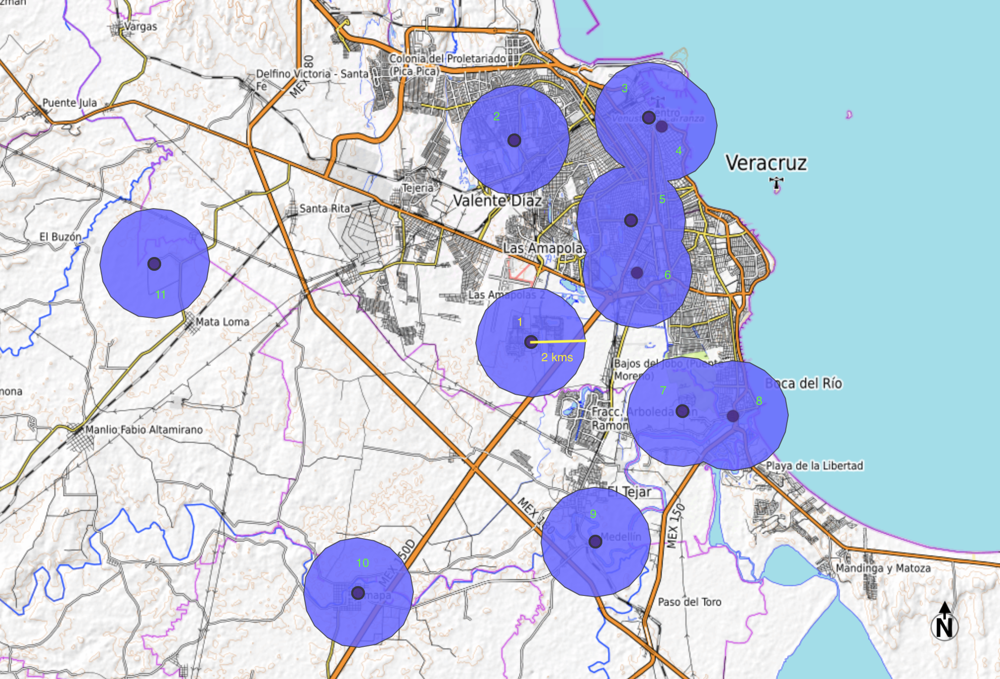
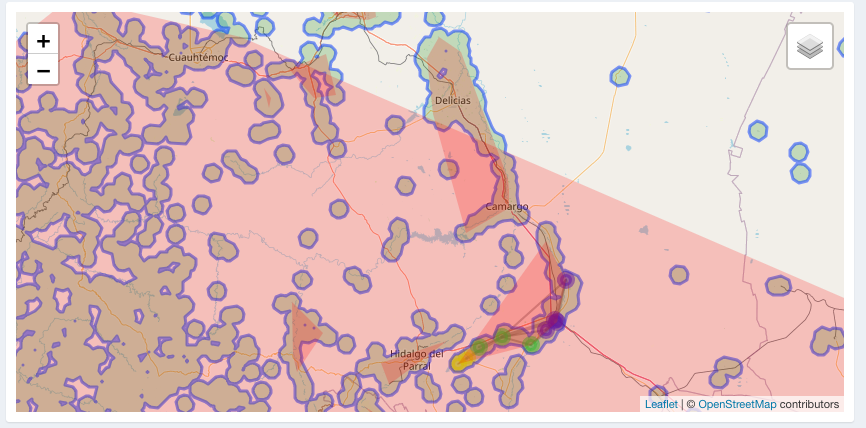
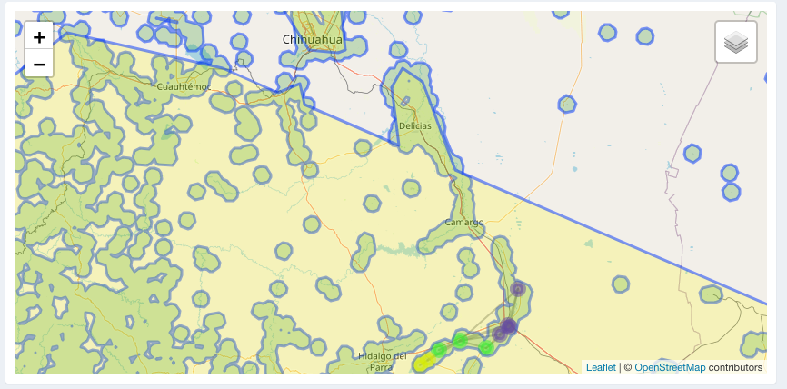
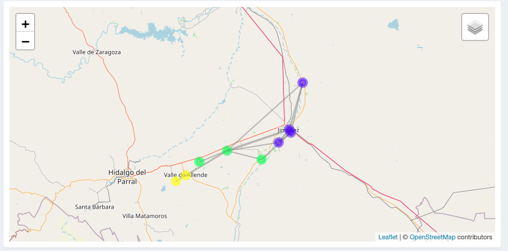
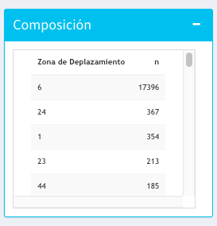
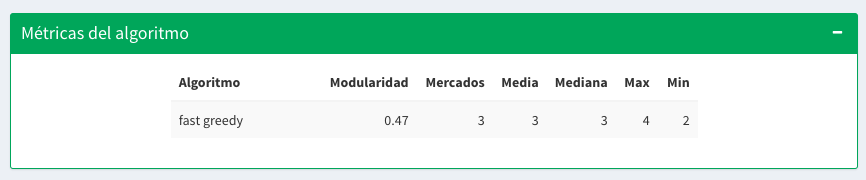
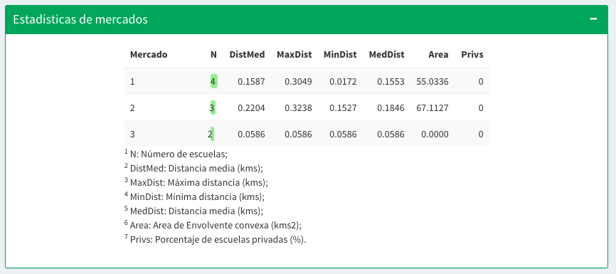
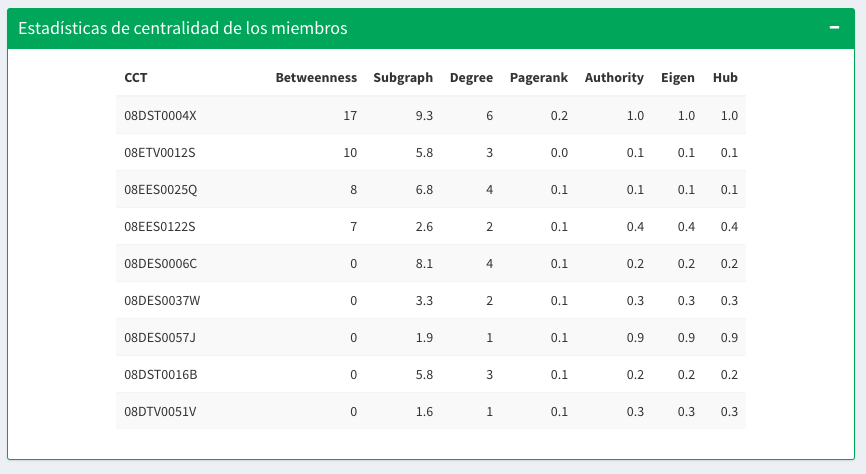
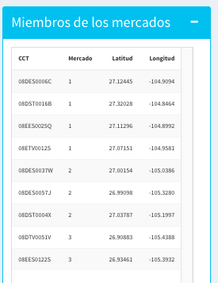

# Mercados Educativos en México

**ITAM - Centro de Investigación en Economía** 

# Problema a resolver

Este trabajo tiene como objetivo identificar mercados educativos en México a nivel primaria y secundaria. Un mercado, en términos económicos, está compuesto por la oferta y la demanda por un bien o servicio, y estas dos facciones determinan el precio por este último. En un mercado educativo, la oferta está compuesta por escuelas que proveen educación y por estudiantes que demandan dicho servicio. Sin embargo, las características específicas de los agentes (geográficas y socio-económicas), implican que haya segmentación en los mercados de este tipo.

Delimitar tales mercados educativos permite estudiar las relaciones entre las centros educativos y aportar entendimiento a las dinámicas de movilidad de los estudiantes que rigen al sector educativo a niveles geográficos de baja agregación. Asimismo, proporciona información sobre las decisiones y preferencias de los padres y estudiantes en la elección por escuelas.

# Metodología

En este proyecto se definen los mercados educativos en varias fases, y se utiliza información geoespacial de los centros educativos y datos de la movilidad de los estudiantes (la demanda) entre escuelas. 

Inicialmente se definen criterios basados en información geoespacial para acotar las delimitaciones de los mercados educativos. Posteriormente, acotando por las áreas geográficas definidas inicialmente, se estudian las migraciones de estudiantes entre los centros educativos. 

Los objetivos puntuales de las distintas fases se definen a continuación:

1. **Crear base de datos de coordenadas**. Utilizando distintas fuentes de datos se creó una base de datos principal con la información de la ubicación de los distintos centros educativos (coordenadas y estado al que pertenece) para todo el territorio mexicano.
 
2. **Computar zonas de desplazamiento[^1]**. Utilizando los datos de las coordenadas geográficas de las escuelas se computaron _buffers_ de 5 kms y 10 kms para los niveles de primaria y secundaria, respectivamente. 

[^1]: Territorios en los cuales gente con ciertas características socioeconómicas y geográficas en común se desplaza diariamente.

3. **Identificar mercados educativos**. Utilizando datos sobre la movilidad de los estudiantes entre centros educativos, se utilizaron algoritmos de detección de comunidades para los diferentes _buffers_ generados se computan los mercados educativos. 

4. **Herramientas de visualización para efectos de validación**. En la práctica no existen metodologías para realizar una validación rigurosa de las comunidades generadas. Dado lo anterior, se generó un herramienta de visualización que permita aportar entendimiento de los resultados computados. 

Este reporte hace un recuento de las metodologías y resultados generados en cada una de las anteriores secciones. El código que hace reproducible este proyecto se encuentra disponible en [https://github.com/C1587S/school_markets_dsp/tree/master/data/buffers](https://github.com/C1587S/school_markets_dsp/tree/master/data/buffers). 

# ¿Qué se está haciendo actualmente?

La definición del concepto de mercados educativos es relativamente reciente en la literatura. En particular, para nuestro conocimiento, existen dos trabajos previos a este que buscan responder preguntas similares.

Inicialmente, Neilson (2013) estudia para Chile los efectos de la estructura de diseño de políticas de cupones sobre incentivos de escuelas, y también los efectos asociados en la distribución del rendimiento académico entre distintos grupos socio-económicos. Para realizar este análisis, este autor construye mercados educativos teniendo en cuenta la distancia como una de las características centrales. 

En particular, este autor resalta la importancia de definir fronteras de mercado más allá de las territoriales administrativas. Por ejemplo, en algunas zonas donde hay Estados con alta interconexión (i.e proximidad espacial), es factible que algunos estudiantes vivan en el Estado A, y por ejemplo, estudien en el Estado B. La razones por las cuales se generen estos comportamientos pueden ser varias, y no únicamente la cercanía geográfica. Por ejemplo, la diferencia en la distribución de precios entre Estados. En este sentido, si se realiza una partición administrativa, se pierde la captación de este tipo de comportamientos. 

La propuesta realizada por Neilson (2013) para abordar este problema en la construcción geográfica de los mercados incluye los siguientes procedimientos: i) se toman como base las divisiones territoriales administrativas; ii) se unen las zonas urbanas que no tienen una distancia superior a 2 kms; iii) se construyen _buffers_ de 1 km alrededor de la frontera de las zonas definidas en ii). Con esta metodología, el autor obtiene un total de 363 mercados que incluyen aproximadamente 4500 escuelas. Donde el mercado más grande incluye más de 1000 escuelas, y los más pequeños, una sola escuela. 

Por otro lado, Posso y Mejía realizan un estudio (en progreso) realizan un estudio de detección de comunidades educativas en Colombia. Estos autores también realizan un análisis granular a nivel de mercados. La definición de mercados educativos utilizó modelos de grafos y los construyó en dos pasos: i) se computan zonas de desplazamiento utilizando los datos de municipio de la residencia de los estudiantes y de las escuelas; ii), dentro de esas zonas se usaron métodos de agrupación de aristas con las escuelas dentro del area de desplazamiento. 

En este proyecto utilizamos un enfoque similar al de Neilson (2013) para crear las areas de desplazamiento, y uno similar al de Posso y Mejía para detectar los mercados educativos.

# Creación de comunidades

En detalle, para calcular los pesos en las artistas, se construyeron matrices de adyacencia que dicen cuántos alumnos tienen en común cada par de colegios, para un periodo dado de tiempo y restringiendo la muestra a alumnos que se cambian entre escuelas (_switchers_). 

Utilizando la matriz de adyacencia, se obtuvieron redes con las cuales se extrajeron los mercados utilizando la función `getLinkCommunities` del paquete `linkcomm` de `R`. La función utiliza el coeficiente de Tanimoto para  obtener la similitud entre los aristas (Ahn, 2010):

$$
S\left(e_{i k}, e_{j k}\right)=\frac{\mathbf{a}_{i} \cdot \mathbf{a}_{j}}{\left|\mathbf{a}_{i}\right|^{2}+\left|\mathbf{a}_{j}\right|^{2}-\mathbf{a}_{i} \cdot \mathbf{a}_{j}}
\label{equ:tani}
$$

donde $a_{i}$ corresponde a  un vector que describe los pesos de los enlaces entre el nodo $i$ y los nodos en las vecindades de primer orden de los nodos $i$ y $j$. Note que esta medida es igual a 0 en caso de que no haya dicha conexión.

Una dificultad para implementar este método con los datos de México es que no están disponibles los domicilios de los alumnos, por lo tanto, resulta difícil construir las areas de desplazamiento. Asimismo, una de las limitaciones de utilizar el método que utilizaron  Posso y Mejía para Colombia para agrupar los aristas es que el algoritmo falla en zonas de desplazamiento con menos de 20 escuelas.

Nuestro enfoque para abordar la creación de areas de desplazamiento en México plantea dos procesos diferentes. Por un lado, utilizamos la metodología similar a la utilizada por Nielson (2013) para la creación de estas zonas territoriales. Y por otro lado, la creación de mercados educativos se realiza con métodos de grafos, de manera similar a lo planteado por Posso y Mejía. 

# Métricas a usar

La métrica a utilizar para evaluar los diferentes algoritmos de agrupamiento será la modularidad. La modularidad (\textit{modularity}) se diseño para medir la fuerza de una división de una red en comunidades. Es decir,  intentar cuantificar qué tan buena o ``cohesiva'' es una separación de nodos en grupos \citep{felipe}.

La modularidad de una gráfica no dirigida y vértices con una agrupación dada $g$ se define como

$$
   Q = \frac{1}{2m}{\sum_{u,v} \left ( A_{u, v} - \frac{k(u)k(v)}{2m} \right)I(g(u), g(v))} \label{eq:modularidad}
$$

donde $A$ es la matriz de adyacencia y $k(u)$ es el grado de $u$. 

Es importante remarcar que la modularidad tiene un limite de resolución y como consecuencia, no es capaz de detectar comunidades pequeñas. 

En particular, elegimos esta métrica de evaluación, en la medida que da un indicio de la solidez de la conexión entre escuelas (nodos) al interior de los mercados educativos (comunidades). En este sentido, nos permite ver qué tan buenos son los mercados que se están generando. Lo anterior, en la medida que, mayor modularidad implica que las escuelas que están en el mismo mercado están altamente interconectadas, y por lo tanto, los alumnos si rotan de manera razonable entre ellas.

# Descripción del Baseline

El baseline es definir los mercados basándose únicamente en el municipio al que pertenece la escuela. Es decir, asignar arbitrariamente todas las escuelas de un municipio a un mercado. 
Con esta definición, se tienen 2,457 mercados en el cual el mercado más grande tiene 292 escuelas y el más chico tiene una escuela. La modularidad de esta agrupación es 0.76. 

# Metodologías e implementación

Lo ideal para construir los mercados educativos sería ``entrar'' en la cabeza de los estudiantes y de los padres para conocer sus preferencias de escuelas, y por lo tanto, entender las dinámicas del cambio entre escuelas de los alumnos.

Como alternativa, podemos ``inferir'' las preferencias con los alumnos que se cambiaron de escuela _switchers_, a partir del monitoreo geográfico de sus cambios de institución. 

## Construcción de tabla de _switchers_

El objetivo de esta tabla es saber cuántos alumnos se cambiaron de la escuela A a la escuela B en un periodo de tiempo.

Para construirla, se utilizaron las bases de datos de la Evaluación Nacional de Logros Académicos en Centros Escolares (ENLACE). En esta base, cada alumno se identifica únicamente por su Clave Única de Registro de Población (CURP) y sabemos la Clave de Centro de Trabajo (CCT). Utilizando los datos desde el 2006 hasta el 2013 (7 años) se identificaron los alumnos que cambiaron de escuela. 

Una de las dificultades de los datos es que si un estudiante faltó el día que se presentó la prueba, para los datos considerados, no hay manera de saber en qué escuela estaba en ese año. Sin embargo, en vez de buscar solo en el año consecutivo, buscamos en todos los años posteriores. Es decir, si la estudiante Paola estuvo en la escuela A en el año 2006 y no presentó la prueba en el año 2007, entonces la buscamos en el año 2008 o en años consecutivos hasta encontrarla. Si encontramos a Paola en la escuela B en el año 2010 entonces registramos que se cambió entre la escuela A y la escuela B. Es importante notar que, es posible que Paola se hubiera cambiado a la escuela C en el 2008 antes de haber entrado a la escuela B; sin embargo, esta información no se capturó. 

Cabe resaltar que para primaria solo 2 millones de alumnos de los 40 millones presentaron un cambio de escuela, y por tanto los capturamos como _switchers_. Es decir, los mercados se construyeron con las preferencias el 5\% de los estudiantes. 

La siguiente taabla muestra un ejemplo del formato de la tabla de _switchers_.

| Escuela de origen | Escuela de destino | Nro. de switchers |
|-------------------|--------------------|-------------------|
| A                 | B                  | 32                |
| B                 | A                  | 2                 |
| C                 | B                  | 12                |

## Creación de area de desplazamiento

Es posible que si se toman en cuenta únicamente criterios de migración de estudiantes de una escuela hacia otra, se generen conexiones entre escuelas que no necesariamente impliquen que estas pertenecen al mismo mercado educativo. Por ejemplo, consideremos el caso de un estudiante que se muda de Ciudad de México a Monterrey, y por tanto, se cambia de escuela. 

En general, esperaríamos que los mercados educativos se encuentren en zonas geográficas cercanas, donde parezca razonable que se abarquen localidades donde gente con ciertas características en común se desplace diariamente. Lo anterior, corresponde al concepto de _areas de desplazamiento_. En este trabajo se delimitan las zonas donde pueden estar los mercados educativos con respecto al anterior concepto. 

La creación de subgrafos puede realizarse de distintas maneras. En este trabajo abordamos dos posibles enfoques: 1) computando _buffers_ [^bignote] alrededor de escuelas para las _areas de desplazamiento_ y 2) utilizando grafos para los mercados. Luego de algunos ejercicios de validación se eligió la forma 1), razón por la cual es la que se explica a detalle. 

[^bignote]: Regiones alrededor de objetos espaciales, cuyos puntos generalmente equidistan de los elementos individuales que lo constituyen. En este ejercicio corresponde a una región circular con un radio en kilómetros definido.

A modo de ejemplo, considere la siguiente figura, en la cual se dibujan los _buffers_ asoaciados a 11 escuelas de secundaria en Veracruz. 

Una vez se han computado los respectivos _buffers_ para la totalidad de escuelas en el conjunto de datos, se procede a identificar cuales están sobrepuestos y comparten intersecciones, y por lo tanto, como conjunto, conforman una zona de desplazamiento. Como se puede notar en la figura, esto sucede para los conjuntos $\left\{ 3,4,5,6\right\} $ y $\left\{ 7,8\right\}$. Lo que implica que en total se tienen siete zonas de desplazamiento. El anterior proceso es extrapolado para todo México.

## Áreas de desplazamiento utilizando buffers

Un _buffer_, es una área que se define  a partir de una estructura espacial. En este caso, son de tipo circular con un radio definido en kilómetros y se forman a partir de las coordenadas de cada escuela. En particular, para esta implementación utilizamos la proyección UTM zona 15N con EPSG 6370 para México[^notaepsg],  y se evalúa el computo de _buffers_ desde 1 km hasta 15 kms (con variaciones de 0.5 kms).

[^notaepsg]: Ver: \url{https://epsg.io/6370}

## Detección de comunidades

La idea principal fue construir un grafo no dirigido en el cual los nodos son las escuelas y los pesos en los aristas son el flujo de alumnos entre las escuelas. 

El primer paso fue construir el grafo. Para encontrar el peso de los aristas se sumaron los alumnos que se cambiaron en ambas direcciones, y se dividió el flujo entre el total de alumnos que se cambiaron entre escuelas como se muestra en la siguiente ecuación:

$$
weight = \frac{\text{cambio de A a B} + \text{cambio de B a A}}{\text{cambios fuera de A} + \text{cambios fuera de B}}
\label{equ:cambios}
$$

A continuación, se compararon los siguientes algoritmos de detección de comunidades:

- _leading eigenvector_: El algoritmo funciona calculando los vectores propios de la matriz de modularidad para el valor propio positivo más grande y después separando los vértices en dos comunidades basado en el signo del vector propio Newman (2006). En el paquete de R igraph está bajo el nombre `cluster_leading_eigen `.    
    
    
- **_label propagation_**: El algoritmo funciona etiquetando los vértices con etiquetas únicas y actualizando las etiquetas con los votos de los vértices vecinos. Es decir, si una escuela está rodeada por cinco escuelas de la comunidad A y tres escuelas de la comunidad B, entonces por mayoría de votos la escuela va a pertencer a la comunidad (Raghavan et. al, 2007).  En el paquete de R igraph está bajo el nombre `cluster_label_prop `.    
    
- **_walktrap_**: El algoritmo encuentra subgrafos densamente conectados por medio de caminatas aleatorias bajo el supuesto que caminatas aleatorias pequeñas tienen a permanecer en la misma comunidad (Pons & Latapy, 2005).  En el paquete de R igraph está bajo el nombre `cluster_walktrap `.  
        
- **_fast greedy_**: Toma un enfoque jerárquico en el cual inicialmente cada nodo es asignado a una comunidad individual y en cada paso los vértices son re-asignados a la comunidad que genere la mayor contribución a la modularidad (Girvan & Newman, 2002).  En el paquete de R igraph está bajo el nombre `cluster_fast_greedy `. 
    
- **_multi level_**: Es muy similar al algoritmo miope (fast greedy) pero incluye un paso de agregación de comunidades que resulta útil para redes muy grandes. Es decir, después de re-asignar los vértices, como en el algoritmo fast greedy, cada comunidad se considera como un vértice y el proceso vuelve a comenzar (Blondel, 2008). En el paquete de R igraph está bajo el nombre `cluster_louvain `. 
    
- **_link communities_**: Se busca encontrar comunidades agrupando los aristas. Es decir, los cambios de estudiantes entre escuelas. Al utilizar el algoritmo de clustering de centroides, una misma escuela puede caer en diferentes clusters, debido a que diferentes aristas pueden pertenecer a diferentes clusters. Para lidiar con esto se hace una "votación" para ver que cluster aparece más veces para una escuela. En el paquete de R linkcom está bajo el nombre `getLinkCommunities `. 

# Visualización de áreas de desplazamiento y comunidades

Esta herramienta de visualización se generó utilizando la librería `shiny` del lenguage `R`, y tiene como objetivo presentar de manera práctica e informativa los resultados del ejercicio de generación de mercados educativos en México a nivel primaria y secundaria por medio de algorítmos de redes.

La visualización general de la aplicación es la siguiente: 

En las siguientes secciones se documenta su uso. 

### Mapa exploratorio:

El mapa exploratorio fue diseñado utilizando la librería `leaflet` y poder medio de las funciones de la misma puede ser modificado.  

El mapa es dinámico y el menú de opciones de visualización se presenta en la siguiente subsección. 

**Panel: Mapa**

Se incorporaron 7 capas al mapa, las cuales se pueden activar o desactivar por medio de un menú desplegable al cual se puede acceder en la esquina superior derecha de la sección donde se visualiza el mapa.

- Escuelas

Define si se desean adicionar todas las escuelas consideradas en el ejercicio. En la imagen de abajo, el círculo verde con un número 4 indica que en ese punto hay 4 escuelas. Si se hace zoom sobre esa área será posible visualizarlas. 

- Buffers

Permite visualizar los buffers de tamaño selecionado durante todo el ejercicio. En el siguiente ejemplo se visualizan algunos para el caso donde el radio de los mismos es de 5 kms. 

- Envolventes convexas

Incluye las envolventes convexas asociadas a los buffers analizados. 

Incluye la unión de envolventes convexas asociadas a los buffers analizados. 

- Unión de envolventes convexas

- Nodos y aristas

Incluyen las aristas y los nodos de la red del área de desplazamiento seleccionada utilizadas para el ejercicio de detección de comunidades. 

En la siguiente imagen se muestran estos elementos para el área de desplazamiento 505.

Cabe denotar que estos elementos tienen información interactiva que da información sobre la red. Por ejemplo, si se pone el puntero encima de los nodos, se presenta el CCT asociado a la escuela y el mercado educativo al que pertenece:

De igual forma, si se sitúa el puntero encima de las aristas de la red, se muestra el flujo de estudiantes (bidireccional) que hubo entre una y otra escuela:

**Panel: Opciones**

El menú de opciones de visualización se presenta en el panel azul de la parte derecha de la aplicación:

Las opciones disponibles son:

- _Nivel educativo_: Se selecciona si se desea evaluar el flujo de estudiantes de primaria o secundaria. 

- _Radio de los buffers:_: Se indica el radio de los buffers calculados, las opciones disponibles son: 5 kms, 8 kms, 12 kms, y 15 kms. 

- _Zona de desplazamiento_: Indica el ID de la zona de desplazamiento sobre la cual se quiere analizar la existencia de comunidades. 

- _Algoritmo de redes_ : Indica el algoritmo utilizado para detección de comunidades. Las opciones incluyen: fast greedy, Walktrap, LeadingEigen, LabelProp, y Multi-level. La implementación de estos algoritmos se realiza por medio de la librería `igraph`.

- _Tipo de aristas_ : Indica el tipo de relaciones que se quieren evaluar en la visualización de la red (actualmente se centra en el flujo bidireccional de estudiantes entre escuela) 

- _Color de las aristas_ : permite cambiar el color de las aristas de forma que permita una visualización más apropiada. 

**Panel: Composición de áreas de desplazamiento**

Muestra el número de escuelas que tiene determinada área de desplazamiento. 

En la parte de abajo de la tabla se muestra información adicional sobre el número (porcentaje) de escuelas que tienen más de uno, dos o tres miembros. 

**Panel: Métricas del algoritmo**

Muestra las métricas de evaluación del algoritmo utilizado para la detección de comunidades: 

**Panel: Estadísticas de mercados**

Muestra las estadísticas generales de las comunidades generadas al interior del área de desplazamiento seleccionada. 

**Panel: Medidas de centralidad**

Muestra las medidas de centralidad de los nodos analizados en la red generada en el área de desplazamiento seleccionada. 

**Panel: Miembros de comunidades**

Muestra en una tabla el CCT de cada escuela y el mercado educativo al que pertenece de acuerdo al algoritmo seleccionado. 

